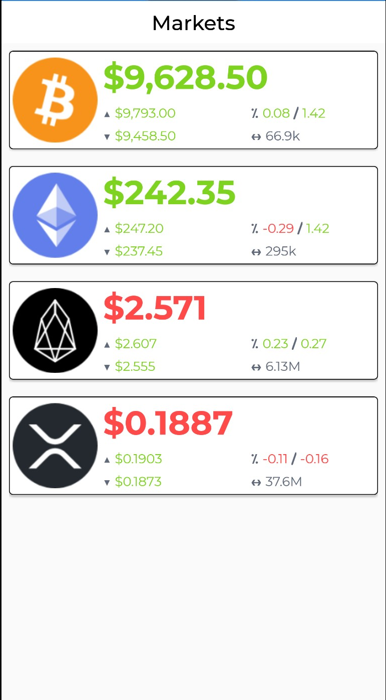
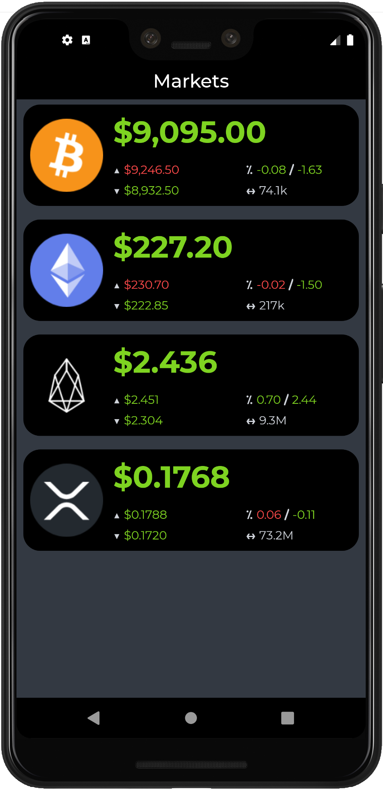
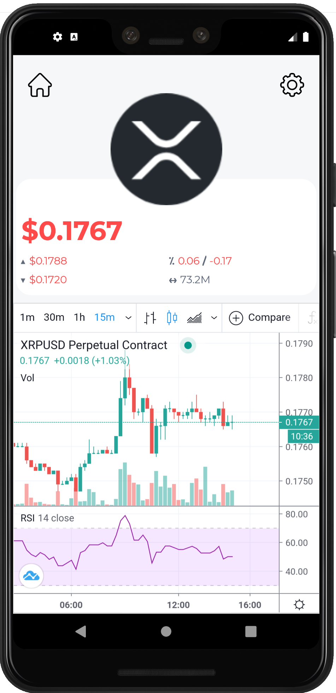
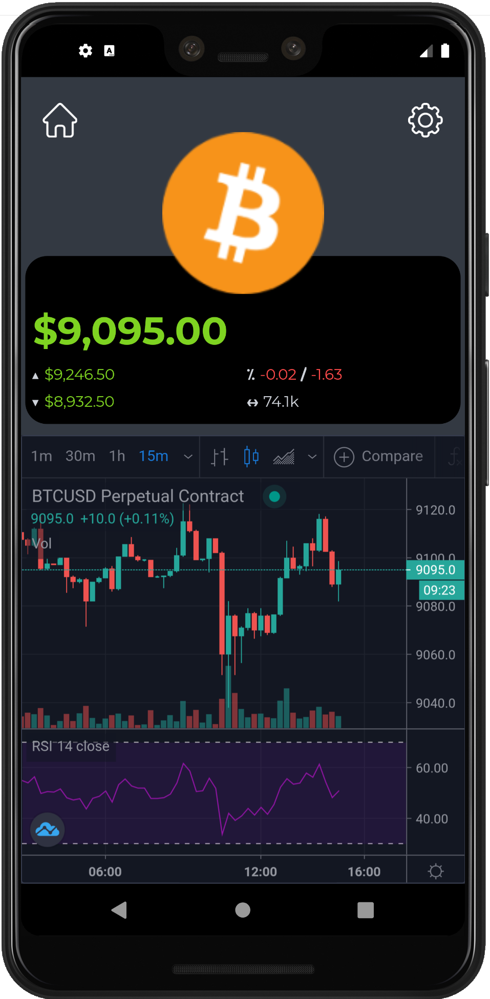

# LiLo.Lite 
Open source repository for the LiLo.Lite (Ladder In Ladder Out) Mobile Application.

## Overview
LiLo 'lite' is a light-weight version of [LiLo](https://georgeleithead.github.io/LiLo_Public/).
The mobile application is written using Xamarin.Forms and integrates with the [ByBit](https://www.bybit.com) WebSockets service to provide live real-time market information, and using a WebView to display charting information from [TradingView](https://uk.tradingview.com/).

### Application Features
- Live real-time market information.
- Price change highlighting.
- Market 24hr price highs and lows.
- 1hr and 24hr price percentage changes.
- 24hr trading volume.
- Real-time currency charting from [TradingView](https://uk.tradingview.com/).

### Code Features
- MVVM pattern (including view model locater).
- Dependency injection.
- WebSockets real-time information.
- Custom converters, behaviors, controls, view extensions and data templates.
- Pancake, CoverFlow and Web views
- Simplified grid row & column definitions
- Light & dark modes
- Shared Transitions

### Libraries used
- [Xamarin.Forms](https://github.com/xamarin/Xamarin.Forms)
- [Xamarin.Essentials](https://github.com/xamarin/Essentials)
- [ResizetizerNT](https://github.com/Redth/ResizetizerNT)
- [websocket-sharp](https://github.com/PingmanTools/websocket-sharp/)
- [System.Text.Json](https://github.com/dotnet/corefx)
- [Xamarin.Forms.PancakeView](https://github.com/sthewissen/Xamarin.Forms.PancakeView)
- [Xamarin.Plugin.SharedTransitions](https://github.com/jsuarezruiz/Xamarin.Plugin.SharedTransitions)

## Supported Platforms: Android, iOS

The LiLo.Lite mobile application is currently available for these platforms:

| Platform | Install | Build Status |
| -------- | ------- | ------------ |
| Android  | [Alpha](https://install.appcenter.ms/users/george-internetwideworld.com/apps/LiLo.Lite.Android/releases/) |        |
| iOS      | Alpha^ | N/A       |

^Currently don't have a MAC available with a new-enough version of XCode to build iOS!

## Social
If you want to get in contact with us on social platforms, you can reach us on .  *No personal information* is collected by the application, as such we do not know who you are, so please get in touch and let us know what you think about LiLo.Lite.

## Reporting bugs
We use GitHub issues  to track issues.  Feedback with improvements and raising of issues will be highly appreciated and accepted.

## Screens
NOTE: All of the screen shots are subject to change as the application evolves.

### Markets view
  

### Chart view
 

## More information
- Source code: https://github.com/GeorgeLeithead/LiLo.Lite
- Author: [George Leithead](https://twitter.com/GeorgeLeithead/)