# LiLo.Lite 
Open source repository for the LiLo.Lite (Ladder In Ladder Out) Mobile Application.

## Overview
LiLo.Lite is a light-weight cryptocurrency (crypto) tracking application.  It provides a quick and easy way to watch the top crypto currency information and charts.  With extremely low battery usage, you can leave the application running in the background and have crypto information available right at your fingertips.

## Screenshots
### Splash Screen
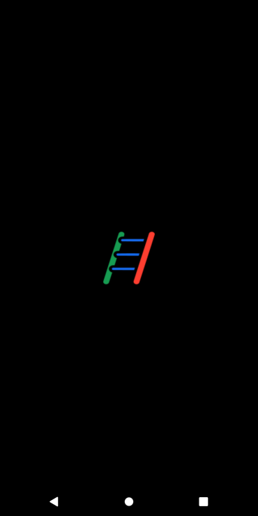
### Markets page
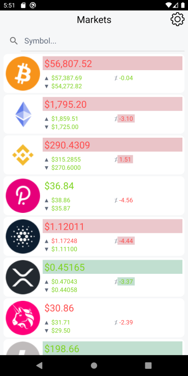
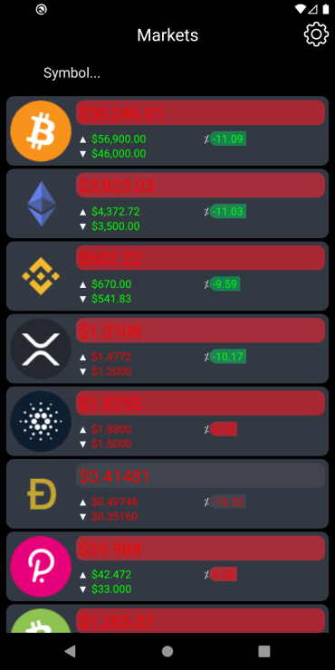
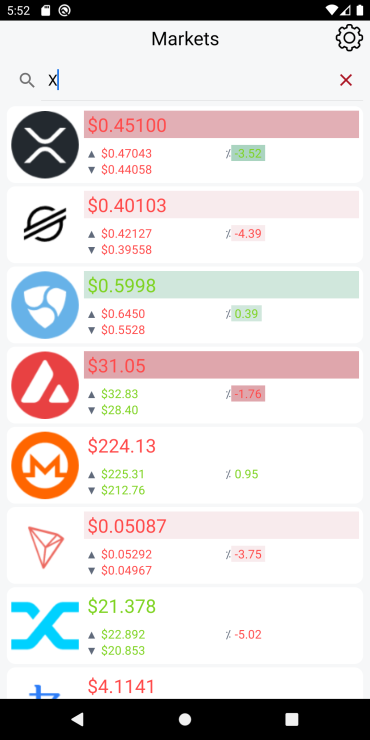
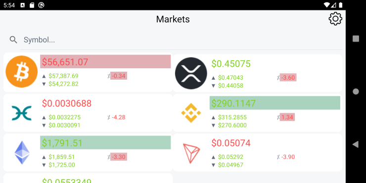
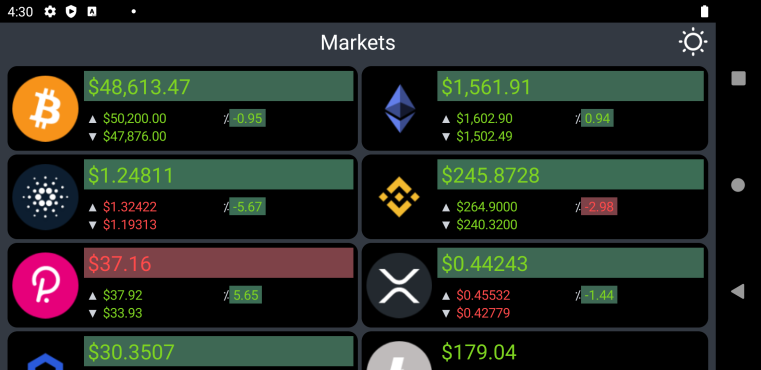

### Chart page
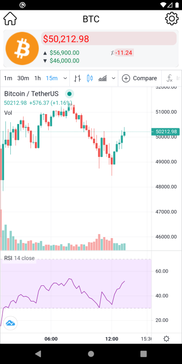
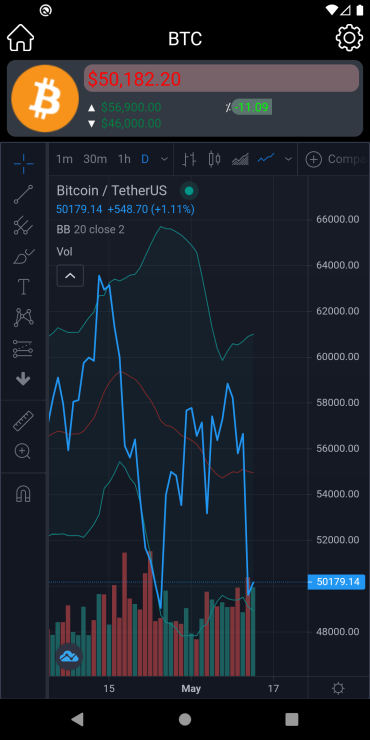

## Settings page
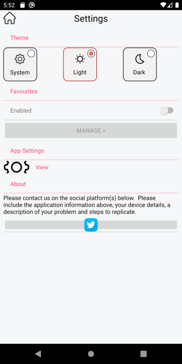
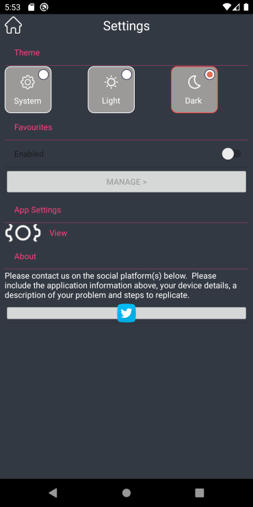

## Manage favourites page
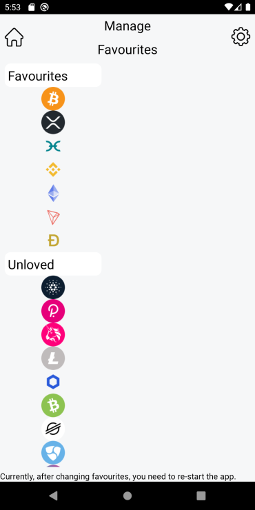
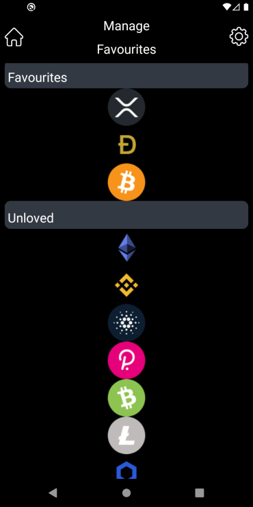

### Additional devices and OS versions

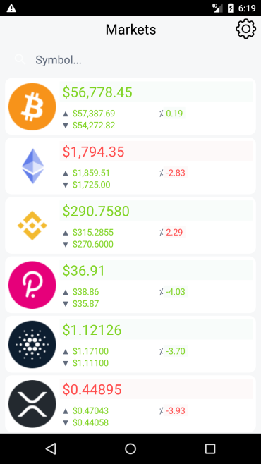

## Supported Platforms: Android, iOS

The LiLo.Lite mobile application is currently available for these platforms:

| Platform | Install | Build Status |
| -------- | ------- | ------------ |
| Android 5.0 and above | [Side-load install](https://install.appcenter.ms/users/george-internetwideworld.com/apps/LiLo.Lite.Android/distribution_groups/public) |        |
| iOS 8.0 and above | Work-in-progress | N/A       |

## Feature highlights include:
- FREE to install and FREE from adverts.
- Access real-time market data from [Binance](https://www.binance.com/).
- Access real-time charting from [TradingView](https://uk.tradingview.com/).
- Only internet permissions needed.
- No personal information collected.
- Price change highlighting.
- Currency 24hr price high, low and percentage changes.
- Simple to use interface.
- Light and dark theme support.
- Extremely low battery use (<2% in a typical use day).
- Support for Android 5.0 (API level 21 - Lollipop) and above.
- Open source.

## Market data for:
- Bitcoin (BTC)
- Etherium (ETH)
- Binance Coin (BNB)
- Cardano (ADA)
- Polkadot (DOT)
- XRP (XRP)
- Litecoin (LTC)
- Chainlink (LINK)
- Bitcoin Cash (BCH)
- Stellar (XLM)
- Uniswap (UNI)
- Dogecoin (DOGE)
- NEM (XEM)
- Cosmos (ATOM)
- Aave (AAVE)
- Solana (SOL)
- Monero (XMR)
- EOS (EOS)
- Tron (TRX)
- MIOTA (IOTA)
- Theta Network (THETA)
- Synthetix Network Token (SNX)
- NEO (NEO)
- Tezos (XTZ)
- Terra (LUNA)
- VeChain (VET)
- FTX Token (FTT)
- Dash (DASH)
- The Graph (GRT)
- Avalanche (AVAX)
- Binance USD (BUSD)
- Kasuma (KSM)
- Sushi (SUSHI)
- Maker (MKR)
- Elrond (EGLD)
- FileCoin (FIL)
- Fantom (FTM)
- Compound (COMP)
- Decred (DCR)
- PancakeSwap (CAKE)
- Ravencoin (RVN)
- ZCash (ZEC)
- Zilliqa (ZIL)
- Etherium Classic (ETC)
- UMA (UMA)
- yearn.finance (YFI)
- THORChain (RUNE)
- Near (NEAR)
- 0x (ZRX)
- REN (REN)
- Waves (WAVES)
- ICON (ICX)
- Stacks (STX)
- Hadera Hashgraph (HBAR)
- BitTirrent (BTT)
- Polygon (MATIC)
- IOST (IOST)
- Algorand (ALGO)
- Paxos Standard (PAX)
- DigiByte (DBG)
- Ontology (ONT)
- Nano (NANO)
- Basic Attention Token (BAT)
- Loopring (LRC)
- OMG Network (OMG)
- Bancor Network Token (BNT)
- Horizen (ZEN)
- Qtum (QTUM)
- Pundi X (NPSX)
- Holo (HOT)
- Enjin Coin (ENJ)
- Curve DAO Token (CRV)
- Siacoin (SC)
- Cyber Network (KNC)
- Swipe (SXP)

## Social contact:
- 
- GitHub: https://github.com/GeorgeLeithead/LiLo.Lite
- Report any 
- Email: [lilo@internetwideworld.com](mailto:lilo@internetwideworld.com)

## Technical Details
The application is written using Xamarin.Forms and integrates with the [Binance](https://www.binance.com/) WebSockets services to provide live real-time market information, and using a WebView to display charting information from [TradingView](https://uk.tradingview.com/).

### Libraries used
- [Xamarin.Forms](https://github.com/xamarin/Xamarin.Forms)
- [Xamarin.Essentials](https://github.com/xamarin/Essentials)
- [Xamarin.CommunityToolkit](https://github.com/xamarin/XamarinCommunityToolkit)
- [ResizetizerNT](https://github.com/Redth/ResizetizerNT)
- [websocket-sharp](https://github.com/PingmanTools/websocket-sharp/)
- [System.Text.Json](https://github.com/dotnet/corefx)
- [Acr.UserDialogs](https://github.com/aritchie/userdialogs)

## More information
- Source code: https://github.com/GeorgeLeithead/LiLo.Lite
- Author: [George Leithead](https://twitter.com/GeorgeLeithead/)
- Icons: [Spot]( https://github.com/spothq/cryptocurrency-icons)