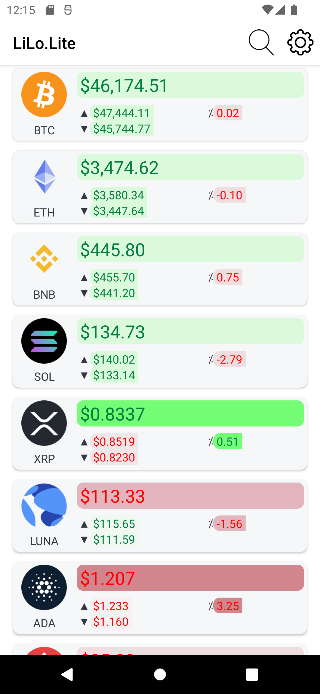
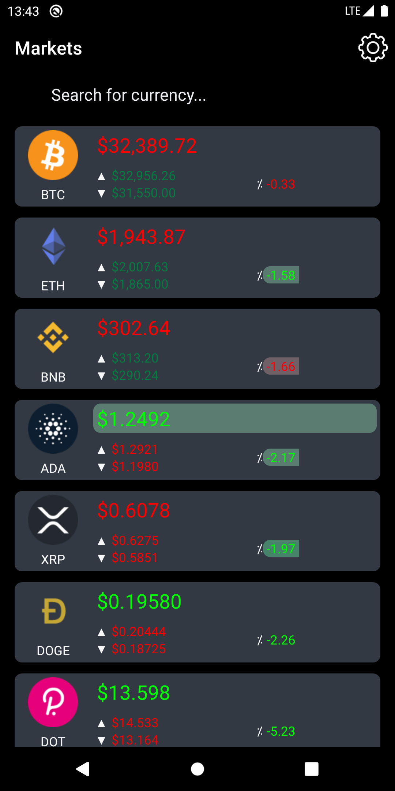
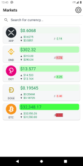
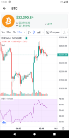
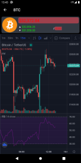
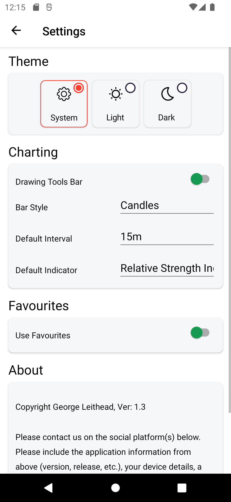
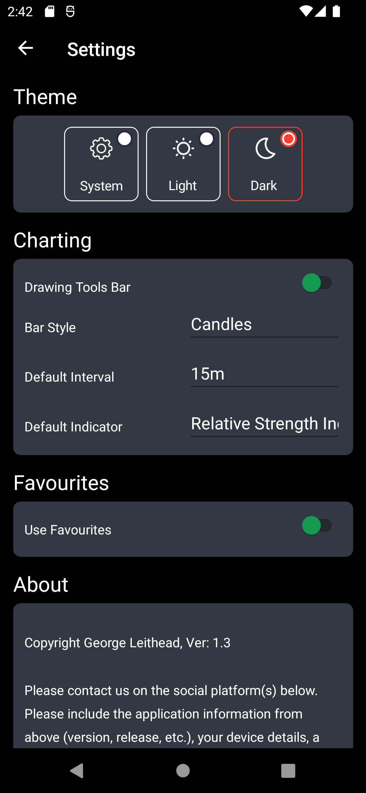
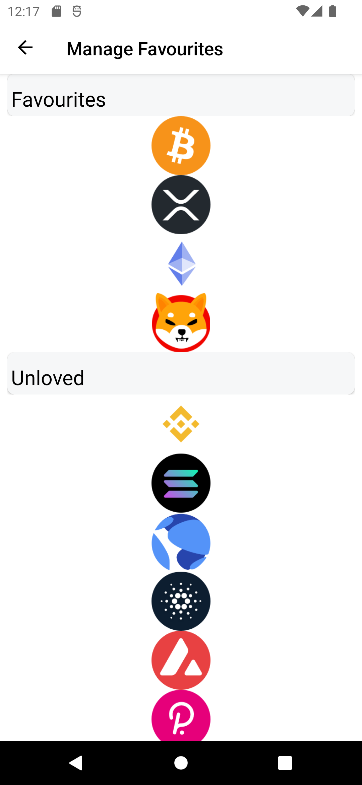
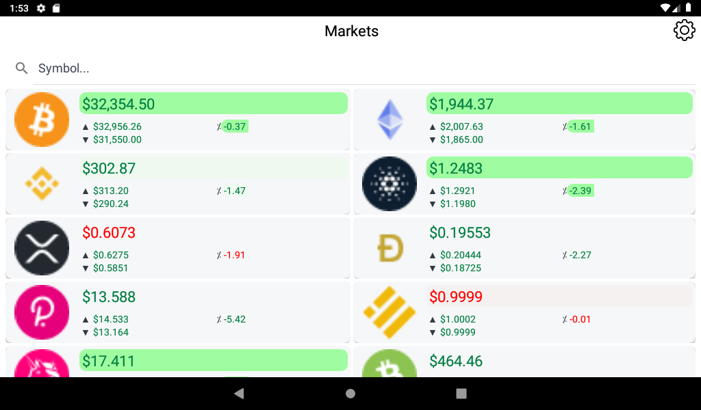
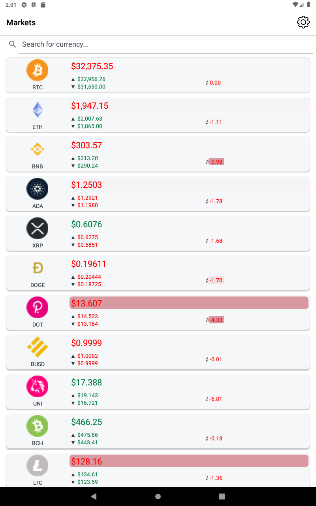

# LiLo.Lite 
Open source repository for the LiLo.Lite (Ladder In Ladder Out) Mobile Application.

## Overview
LiLo.Lite is a live real-time cryptocurrency (crypto) price tracking application.  Providing an easy way to watch the top crypto currency prices and charts.
With extremely low battery usage, you can leave the application running in the background and have crypto information available right at your fingertips.

## Screenshots
### Splash Screen
{width=137px}
### Markets page
{width=137px}
{width=137px}
{width=137px}

### Chart page
{width=137px}
{width=137px}

## Settings page
{width=137px}
{width=137px}

## Manage favourites page
{width=137px}

### Additional devices and OS versions
{height=137px}
{width=137px}

## Supported Platforms: Android, iOS

The LiLo.Lite mobile application is currently available for these platforms:

| Platform | Install | Build Status |
| -------- | ------- | ------------ |
| Android 5.0 and above |  |  |
| iOS 8.0 and above | Work-in-progress |  |

## Feature highlights include:
- FREE to install and FREE from adverts.
- Access real-time market data from [Binance](https://www.binance.com/).
- Access real-time charting from [TradingView](https://uk.tradingview.com/).
- Price change highlighting.
- Currency 24hr price high, low and percentage changes.
- Custom charting options.
- Simple to use interface.
- Light and dark theme support.
- Only internet permissions needed.
- No personal information collected.
- Extremely low battery use (<2% in a typical use day).
- Support for Android 5.0 (API level 21 - Lollipop) and above.
- Open source.

## Market data for:
- { width=16,height:16} Bitcoin (BTC)
- { width=16,height:16} Etherium (ETH)
- {width=16,height:16} Binance Coin (BNB)
- {width=16,height:16} Cardano (ADA)
- {width=16,height:16} Polkadot (DOT)
- {width=16,height:16} Ripple (XRP)
- {width=16,height:16} Litecoin (LTC)
- {width=16,height:16} Chainlink (LINK)
- {width=16,height:16} Bitcoin Cash (BCH)
- {width=16,height:16} Stellar (XLM)
- {width=16,height:16} Uniswap (UNI)
- {width=16,height:16} Dogecoin  (DOGE)
- {width=16,height:16} NEM (XEM)
- {width=16,height:16} Cosmos (ATOM)
- {width=16,height:16} (AAVE)
- {width=16,height:16} Solana (SOL)
- {width=16,height:16} Monero (XMR)
- {width=16,height:16} (EOS)
- {width=16,height:16} Tron (TRX)
- {width=16,height:16} MIOTA (IOTA)
- {width=16,height:16} Theta Network (THETA)
- {width=16,height:16} (NEO)
- {width=16,height:16} Tezos (XTZ)
- {width=16,height:16} Terra (LUNA)
- {width=16,height:16} VeChain (VET)
- {width=16,height:16} FTX Token (FTT)
- {width=16,height:16} (DASH)
- {width=16,height:16} The Graph (GRT)
- {width=16,height:16} Avalanche (AVAX)
- {width=16,height:16} Binance USD (BUSD)
- {width=16,height:16} Kasuma (KSM)
- {width=16,height:16} Maker (MKR)
- {width=16,height:16} Elrond (EGLD)
- {width=16,height:16} FileCoin (FIL)
- {width=16,height:16} Fantom (FTM)
- {width=16,height:16} Compound (COMP)
- {width=16,height:16} PancakeSwap (CAKE)
- {width=16,height:16} ZCash (ZEC)
- {width=16,height:16} Etherium Classic (ETC)
- {width=16,height:16} THORChain (RUNE)
- {width=16,height:16} (NEAR)
- {width=16,height:16} (WAVES)
- {width=16,height:16} Stacks (STX)
- {width=16,height:16} Hadera Hashgraph (HBAR)
- {width=16,height:16} Polygon (MATIC)
- {width=16,height:16} Algorand (ALGO)
- {width=16,height:16} Basic Attention Token (BAT)
- {width=16,height:16} Loopring (LRC)
- {width=16,height:16} (QTUM)
- {width=16,height:16} Holo (HOT)
- {width=16,height:16} Enjin Coin (ENJ)
- {width=16,height:16} Curve DAO Token (CRV)
- {width=16,height:16} Shiba Inu (SHIB)
- {width=16,height:16} Axie Infinity (AXS)
- {width=16,height:16} Internet Computer (ICP)
- {width=16,height:16} The Sandbox (SAND)
- {width=16,height:16} Decentraland (MANA)
- {width=16,height:16} Helium (HNT)
- {width=16,height:16} (FLOW)
- {width=16,height:16} Klaytn (KLAY)
- {width=16,height:16} Harmony (ONE)
- {width=16,height:16} Arweave (AR)
- {width=16,height:16} (AMP)
- {width=16,height:16} eCash (XEC)
- {width=16,height:16} Quant (QNT)
- {width=16,height:16} Theta Fuel (TFUEL)
- {width=16,height:16} (CELO)
- {width=16,height:16} IoTeX (IOTX)
- {width=16,height:16} Bancor Network Token (BNT)
- {width=16,height:16} Decred (DCR)
- {width=16,height:16} DigiByte (DGB)
- {width=16,height:16} ICON (ICX)
- {width=16,height:16} (IOST)
- {width=16,height:16} Kyber Network Crystal (KNC)
- {width=16,height:16} OMG Network (OMG)
- {width=16,height:16} Ontology (ONT)
- {width=16,height:16} (REN)
- {width=16,height:16} Ravencoin (RVN)
- {width=16,height:16} Siacoin (SC)
- {width=16,height:16} Synthetix Network Token (SNX)
- {width=16,height:16} (SUSHI)
- {width=16,height:16} (SXP)
- {width=16,height:16} (UMA)
- {width=16,height:16} yearn.finance (YFI)
- {width=16,height:16} Horizen (ZEN)
- {width=16,height:16} Zilliqa (ZIL)
- {width=16,height:16} 0x (ZRX)
- {width=16,height:16} TrueUSD (TUSD)
- {width=16,height:16} Gnosis (GNO)
- {width=16,height:16} Livepeer (LPT)
- {width=16,height:16} (ANKR)
- {width=16,height:16} Bitcoin Gold (BTG)
- {width=16,height:16} Syscoin (SYS)
- {width=16,height:16} SKALE (SKL)
- {width=16,height:16} Polymath (POLY)
- {width=16,height:16} PAX Gold (PAXG)
- {width=16,height:16} (FLUX)
- {width=16,height:16} (DENT)
- {width=16,height:16} Lisk (LSK)
- {width=16,height:16} Power Ledger (POWR)
- {width=16,height:16} (GALA)
- {width=16,height:16} Frax Share (FXS)
- {width=16,height:16} Convex Finance (CVX)
- {width=16,height:16} Oasis Network (ROSE)
- {width=16,height:16} Secret (SCRT)
- {width=16,height:16} Pax Dollar (USDP)
- {width=16,height:16} Smooth Love Potion (SLP)
- {width=16,height:16} Mina Protocol (MINA)
- {width=16,height:16} (1INCH)
- {width=16,height:16} WAX (WAXP)
- {width=16,height:16} Chiliz (CHZ)
- {width=16,height:16} Audius (AUDIO)
- {width=16,height:16} (KAVA)
- {width=16,height:16} Immutable X (IMX)
- {width=16,height:16} Nervos Network (CKB)
- {width=16,height:16} (HIVE)
- {width=16,height:16} Anyswap (ANY)
- {width=16,height:16} JUST (JST)
- {width=16,height:16} Etherium Name Service (ENS)
- {width=16,height:16} Coin98 (C98)

## Social contact:
- 
- GitHub: https://github.com/GeorgeLeithead/LiLo.Lite
- Report any 
- Email: [lilo@internetwideworld.com](mailto:lilo@internetwideworld.com)

## Technical Details
The application is written using Xamarin.Forms and integrates with the [Binance](https://www.binance.com/) WebSockets services to provide live real-time market information, and using a WebView to display charting information from [TradingView](https://uk.tradingview.com/).

### Libraries used
- [Xamarin.Forms](https://github.com/xamarin/Xamarin.Forms)
- [Xamarin.Essentials](https://github.com/xamarin/Essentials)
- [Xamarin.CommunityToolkit](https://github.com/xamarin/XamarinCommunityToolkit)
- [ResizetizerNT](https://github.com/Redth/ResizetizerNT)
- [websocket-sharp](https://github.com/PingmanTools/websocket-sharp/)
- [System.Text.Json](https://github.com/dotnet/corefx)
- [Acr.UserDialogs](https://github.com/aritchie/userdialogs)

## More information
- Source code: https://github.com/GeorgeLeithead/LiLo.Lite
- Author: [George Leithead](https://twitter.com/GeorgeLeithead/)
- Icons: [Spot]( https://github.com/spothq/cryptocurrency-icons)