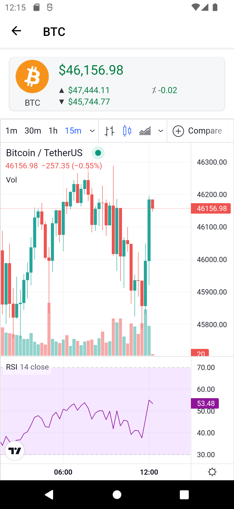
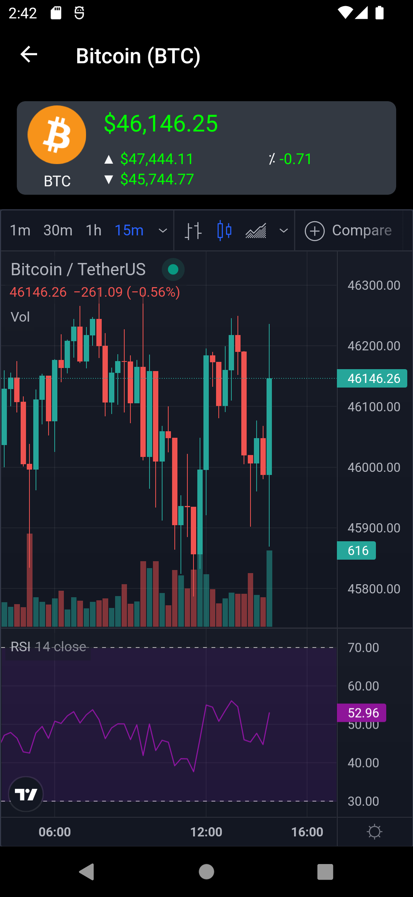

### Chart page
 

## Settings page
 

## Manage favourites page

### Additional devices and OS versions
 

## Supported Platforms: Android, iOS

The LiLo.Lite mobile application is currently available for these platforms:

| Platform | Install | Build Status |
| -------- | ------- | ------------ |
| Android 5.0 and above |  |  |
| iOS 8.0 and above | Work-in-progress |  |

## Feature highlights include:
- FREE to install and FREE from adverts.
- Access real-time market data from [Binance" src="https://www.binance.com/).
- Access real-time charting from [TradingView" src="https://uk.tradingview.com/).
- Price change highlighting.
- Currency 24hr price high, low and percentage changes.
- Custom charting options.
- Simple to use interface.
- Light and dark theme support.
- Only internet permissions needed.
- No personal information collected.
- Extremely low battery use (<2% in a typical use day).
- Support for Android 5.0 (API level 21 - Lollipop) and above.
- Open source.

## Market data for:
-  Bitcoin (BTC)
-  Etherium (ETH)
-  Binance Coin (BNB)
-  Cardano (ADA)
-  Polkadot (DOT)
-  Ripple (XRP)
-  Litecoin (LTC)
-  Chainlink (LINK)
-  Bitcoin Cash (BCH)
-  Stellar (XLM)
-  Uniswap (UNI)
-  Dogecoin  (DOGE)
-  NEM (XEM)
-  Cosmos (ATOM)
-  (AAVE)
-  Solana (SOL)
-  Monero (XMR)
-  (EOS)
-  Tron (TRX)
-  MIOTA (IOTA)
-  Theta Network (THETA)
-  (NEO)
-  Tezos (XTZ)
-  Terra (LUNA)
-  VeChain (VET)
-  FTX Token (FTT)
-  (DASH)
-  The Graph (GRT)
-  Avalanche (AVAX)
-  Binance USD (BUSD)
-  Kasuma (KSM)
-  Maker (MKR)
-  Elrond (EGLD)
-  FileCoin (FIL)
-  Fantom (FTM)
-  Compound (COMP)
-  PancakeSwap (CAKE)
-  ZCash (ZEC)
-  Etherium Classic (ETC)
-  THORChain (RUNE)
-  (NEAR)
-  (WAVES)
-  Stacks (STX)
-  Hadera Hashgraph (HBAR)
-  Polygon (MATIC)
-  Algorand (ALGO)
-  Basic Attention Token (BAT)
-  Loopring (LRC)
-  (QTUM)
-  Holo (HOT)
-  Enjin Coin (ENJ)
-  Curve DAO Token (CRV)
-  Shiba Inu (SHIB)
-  Axie Infinity (AXS)
-  Internet Computer (ICP)
-  The Sandbox (SAND)
-  Decentraland (MANA)
-  Helium (HNT)
-  (FLOW)
-  Klaytn (KLAY)
-  Harmony (ONE)
-  Arweave (AR)
-  (AMP)
-  eCash (XEC)
-  Quant (QNT)
-  Theta Fuel (TFUEL)
-  (CELO)
-  IoTeX (IOTX)
-  Bancor Network Token (BNT)
-  Decred (DCR)
-  DigiByte (DGB)
-  ICON (ICX)
-  (IOST)
-  Kyber Network Crystal (KNC)
-  OMG Network (OMG)
-  Ontology (ONT)
-  (REN)
-  Ravencoin (RVN)
-  Siacoin (SC)
-  Synthetix Network Token (SNX)
-  (SUSHI)
-  (SXP)
-  (UMA)
-  yearn.finance (YFI)
-  Horizen (ZEN)
-  Zilliqa (ZIL)
-  0x (ZRX)
-  TrueUSD (TUSD)
-  Gnosis (GNO)
-  Livepeer (LPT)
-  (ANKR)
-  Bitcoin Gold (BTG)
-  Syscoin (SYS)
-  SKALE (SKL)
-  Polymath (POLY)
-  PAX Gold (PAXG)
-  (FLUX)
-  (DENT)
-  Lisk (LSK)
-  Power Ledger (POWR)
-  (GALA)
-  Frax Share (FXS)
-  Convex Finance (CVX)
-  Oasis Network (ROSE)
-  Secret (SCRT)
-  Pax Dollar (USDP)
-  Smooth Love Potion (SLP)
-  Mina Protocol (MINA)
-  (1INCH)
-  WAX (WAXP)
-  Chiliz (CHZ)
-  Audius (AUDIO)
-  (KAVA)
-  Immutable X (IMX)
-  Nervos Network (CKB)
-  (HIVE)
-  Anyswap (ANY)
-  JUST (JST)
-  Etherium Name Service (ENS)
-  Coin98 (C98)

## Social contact:
- 
- GitHub: https://github.com/GeorgeLeithead/LiLo.Lite
- Report any 
- Email: [lilo@internetwideworld.com](mailto:lilo@internetwideworld.com)

## Technical Details
The application is written using Xamarin.Forms and integrates with the [Binance](https://www.binance.com/) WebSockets services to provide live real-time market information, and using a WebView to display charting information from [TradingView](https://uk.tradingview.com/).

### Libraries used
- [Xamarin.Forms](https://github.com/xamarin/Xamarin.Forms)
- [Xamarin.Essentials](https://github.com/xamarin/Essentials)
- [Xamarin.CommunityToolkit](https://github.com/xamarin/XamarinCommunityToolkit)
- [ResizetizerNT](https://github.com/Redth/ResizetizerNT)
- [websocket-sharp](https://github.com/PingmanTools/websocket-sharp/)
- [System.Text.Json](https://github.com/dotnet/corefx)
- [Acr.UserDialogs](https://github.com/aritchie/userdialogs)

## More information
- Source code: https://github.com/GeorgeLeithead/LiLo.Lite
- Author: [George Leithead](https://twitter.com/GeorgeLeithead/)
- Icons: [Spot]( https://github.com/spothq/cryptocurrency-icons)